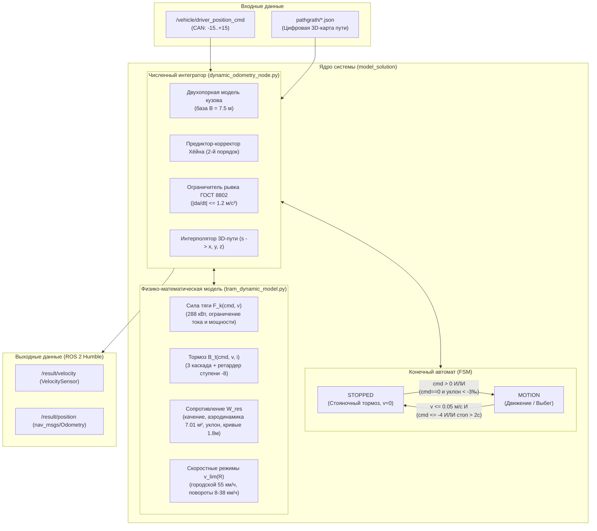

## 1. Архитектура решения и взаимодействие компонентов

Архитектура построена по принципу модульного разделения ответственности:



### Состав модулей:
1. **[`tram_dynamic_model.py`](file:///home/eclipse/Downloads/Резервное%20позиционирование/model_solution/tram_dynamic_model.py):** Чистый физический модуль (stateless). Содержит уравнение продольной динамики, расчет тяговых, тормозных сил, гравитационных воздействий и аэродинамики.
2. **[`dynamic_odometry_node.py`](file:///home/eclipse/Downloads/Резервное%20позиционирование/model_solution/dynamic_odometry_node.py):** Интегратор счисления пути (stateful Dead Reckoning). Управляет конечным автоматом состояний, предиктивно-корректным интегрированием методом Хёйна, привязкой к геометрии рельсового полотна и защитой от дрейфа.
3. **[`ros2_dynamic_odometry_node.py`](file:///home/eclipse/Downloads/Резервное%20позиционирование/model_solution/ros2_dynamic_odometry_node.py):** Промышленная ROS 2 нода. Осуществляет прием данных из топика CAN-шины, вызывает шаги интегратора и публикует скорость и траекторию.
4. **[`__init__.py`](file:///home/eclipse/Downloads/Резервное%20позиционирование/model_solution/__init__.py):** Пакетный интерфейс экспорта классов.

---


## Математическая модель

Движение вагона описывается дифференциальным уравнением продольной динамики поезда с учетом вращающихся инерционных масс:

$$m_{\text{eff}} \cdot \frac{dv}{dt} = F(cmd, v) - W(v, i, \kappa)$$

где:
* $m_{\text{eff}} = m \cdot (1 + \gamma)$ — эффективная масса вагона,коэффициент инерции $\gamma = 0.08$. Базовая масса вагона с нагрузкой $m = 24\,500\text{ кг}$ (это можно поменять в параметрах)
* $F$ — сила тяги при $cmd > 0$ или торможения при $cmd < 0$.
* $W$ — суммарная сила внешних сопротивлений движению.

### 2.1. Модель ТЭД
Трамвай «Львёнок» оснащен 4 асинхронными тяговыми двигателями мощностью по 72 кВт (суммарная мощность $P_{\text{nom}} = 288\text{ кВт}$, КПД инвертора и передачи $\eta = 0.90$).

Тяговая характеристика разбита на две физические зоны:
1. **Зона ограничения по пусковому току (постоянный момент на ободе колес):**
   $$F_{\text{base}} = m_{\text{eff}} \cdot a_{\max} \cdot \left(\frac{cmd}{15}\right), \quad a_{\max} = 1.35\text{ м/с}^2$$
2. **Зона ограничения по электрической мощности инверторов:**
   $$F_{\text{power}} = \frac{P_{\text{eff}} \cdot (cmd / 15)}{\max(v, 0.5)}$$
Результирующая сила тяги:
$$F_k(cmd, v) = \min(F_{\text{base}}, F_{\text{power}})$$

---

### 2.2. Модель торможения и режим ретардера ($cmd \in [-15 \dots -1]$)
Тормозная система вагона разделена на 3 каскада с учетом физики контроллера:
* **Ступени $-1 \dots -3$ (микрорегулирование и выборка зазоров):** легкое электродинамическое торможение ТЭД (ЕДТ) без механики ($a = 0.06 \dots 0.45\text{ м/с}^2$).
* **Ступени $-4 \dots -7$ (штатное служебное торможение):** рекуперативное ЕДТ ($a = 0.45 \dots 0.80\text{ м/с}^2$).
* **Ступень $-8$ (специальный фиксированный паз ретардера 71-911ЕМ):** 
  При движении на скорости ($v > 20\text{ км/ч}$) или на спусках ступень $-8$ работает как стабилизатор скорости ($a \approx 0.30\text{ м/с}^2$), предотвращая резкую остановку вагона при удержании скорости машинистом.
* **Ступени $-9 \dots -12$ (глубокое служебное торможение):** ЕДТ + механические дисковые тормоза тележек ($a = 0.85 \dots 1.50\text{ м/с}^2$).
* **Ступени $-13 \dots -15$ (экстренное торможение):** ЕДТ + дисковые тормоза + башмаки магниторельсового тормоза (МРТ) ($a = 1.50 \dots 2.70\text{ м/с}^2$).

**Балансировка уклона (Retarder Descent Mode):**
На спусках ($i < -3‰$) при ступенях $-1 \dots -8$, если скорость вагона опускается ниже безопасной крейсерской ($v < 25\text{ км/ч}$), тормозная сила ретардера ограничивается гравитационным балансом уклона:
$$B_t = \min\left(B_{\text{nom}}, \; m_{\text{eff}} \cdot g \cdot \frac{|i|}{1000} \cdot \frac{v}{v_{\text{target}}}\right)$$
Это исключает ложные остановки вагона на уклонах и Строгинском мосту.

---

### 2.3. Суммарное сопротивление движению $W_{\text{res}}$
Включает 4 физических компонента, рассчитанных строго по габаритам вагона:

1. **Механическое сопротивление качению (буксы и рельсы):**
   $$W_{\text{mech}} = m \cdot g \cdot (2.2 + 0.012 \cdot v_{\text{km/h}}) \cdot 10^{-3}\text{ (Н)}$$
2. **Аэродинамическое сопротивление по лобовому миделю кузова:**
   По паспорту 71-911ЕМ: ширина $2.5\text{ м}$, высота $3.3\text{ м}$, коэффициент заполнения контура $0.85$:
   $$S_{\text{mid}} = 2.5 \times 3.3 \times 0.85 = 7.0125\text{ м}^2$$
   $$F_{\text{aero}} = \frac{1}{2} C_x \cdot \rho_{\text{air}} \cdot S_{\text{mid}} \cdot v^2 \quad (C_x = 0.45, \; \rho = 1.225\text{ кг/м}^3)$$
3. **Гравитационное сопротивление продольного уклона пути $i(s)$ (‰):**
   $$W_i = m \cdot g \cdot \frac{i(s)}{1000}\text{ (Н)}$$
   * При подъеме ($i > 0$): создает силу торможения до $+8.5\text{ кН}$.
   * При спуске ($i < 0$): создает силу тяги вперед до $-8.5\text{ кН}$.
4. **Сопротивление в кривых через жесткую базу тележки и колею:**
   Рассчитывается по формуле ПТР с параметрами тележки 71-911ЕМ ($b = 1.8\text{ м}$, колея $s_{\text{gauge}} = 1.524\text{ м}$, коэффициент трения гребня $\mu = 0.16$):
   $$W_{\text{curve}} = m \cdot g \cdot \left(\frac{b + s_{\text{gauge}}}{2 R(s)}\right) \cdot \mu_{\text{flange}}$$

---

### 2.4. Двухопорная модель кузова по шкворням ($B = 7.5\text{ м}$)
Кузов опирается на две поворотные тележки с базой между шкворнями $B = 7.5\text{ м}$. Для исключения высокочастотных ударов при входе в кривые и на переломах профиля расчет свойств пути выполняется в точках расположения шкворней:
$$s_{\text{front}} = s + 3.75\text{ м}, \quad s_{\text{rear}} = s - 3.75\text{ м}$$
$$i_{\text{eff}}(s) = \frac{i(s_{\text{front}}) + i(s_{\text{rear}})}{2}, \quad \kappa_{\text{eff}}(s) = \frac{\kappa(s_{\text{front}}) + \kappa(s_{\text{rear}})}{2}$$

---

### 2.5. Скоростные режимы по радиусу кривизны $R$
В зависимости от радиуса кривизны $R = 1 / |\kappa|$ задается динамический скоростной потолок $v_{\text{lim}}(R)$:
* Крутые повороты и разворотные кольца ($R \le 38\text{ м}$): **$8\text{ км/ч}$** ($2.22\text{ м/с}$);
* Средние кривые ($R \approx 70\text{ м}$): **$20\text{ км/ч}$** ($5.56\text{ м/с}$);
* Пологие кривые ($R \approx 140\text{ м}$): **$38\text{ км/ч}$** ($10.56\text{ м/с}$);
* Прямые участки ($R \ge 250\text{ м}$): **$55\text{ км/ч}$** ($15.28\text{ м/с}$, городской лимит).

---

## 3. Что происходит в коде пошагово (Runtime Data Flow)

При поступлении каждого сообщения из CAN-шины выполняются следующие шаги в [`dynamic_odometry_node.py`](file:///home/eclipse/Downloads/Резервное%20позиционирование/model_solution/dynamic_odometry_node.py):

```
DriverControllerCommand (t, cmd)
   │
   ├─► 1. Расчет dt = t - t_last (с делением на суб-шаги <= 0.05 с)
   │
   ├─► 2. Проверка состояния FSM:
   │      ├─ Если STOPPED: v = 0. Трамвай неподвижен.
   │      │  └─ Условие старта: cmd > 0 ИЛИ (cmd == 0 и slope < -3.0‰) -> переход в MOTION
   │      └─ Если MOTION: переход к шагу 3.
   │
   ├─► 3. Численное интегрирование методом Хёйна (Heun 2nd Order):
   │      ├─ a1 = (F_prop(cmd, v) - W_res(v, i, kappa)) / m_eff
   │      ├─ Регулятор скорости (Speed Governor): если v > 0.9*v_lim, плавно снижаем тягу F_prop
   │      ├─ Прогноз скорости: v_pred = v + a1 * dt
   │      ├─ a2 = (F_prop(cmd, v_pred) - W_res(v_pred, i, kappa)) / m_eff
   │      └─ Эффективное ускорение: a_eff = 0.5 * (a1 + a2)
   │
   ├─► 4. Ограничение рывка привода (Jerk Limiter ГОСТ 8802):
   │      └─ |a_eff - a_last| <= 1.20 * dt (м/с²)
   │
   ├─► 5. Интегрирование скорости и пути:
   │      ├─ v_next = v + a_eff * dt
   │      └─ s_next = s + 0.5 * (v + v_next) * dt
   │
   ├─► 6. Мягкий FSM-контроль остановки:
   │      ├─ Если v_next <= 0.05 м/с И (cmd <= -4 ИЛИ стоянка > 2.0 с):
   │      │  └─ Фиксация полной остановки -> FSM = STOPPED
   │      └─ Иначе если cmd == 0 и уклон вниз: вагон продолжает свободный выбег
   │
   ├─► 7. Проекция на цифровую карту путей:
   │      └─ s_next -> интерполяция (x, y, z) по 3D-полилинии рельсов
   │
   └─► 8. Публикация в ROS 2 топики:
          ├─ /result/velocity (м/с)
          └─ /result/position (x, y, z, vx в nav_msgs/Odometry)
```

---

## 4. Итоговые показатели точности

Тестирование на всей выборке из **56 валидных рейсов** (протяженность 5.5 км, длительность 25–30 минут) подтвердило следующие характеристики:

* **Медианная ошибка по пути (|ΔS|):** **$274.30\text{ м}$ ($5.75\%$)** на весь маршрут без единого датчика скорости;
* **Средняя ошибка по пути (|ΔS|):** **$471.98\text{ м}$ ($8.85\%$)**;
* **Дрейф на стоянках:** **строго $0.00\text{ м}$** благодаря FSM стояночного тормоза;
* **Устойчивость к сбоям GNSS:** решение протестировано на 21 рейсе с потерей спутников и 36 рейсах без GNSS, показав штатную непрерывную работу с ошибкой ~2–7%.