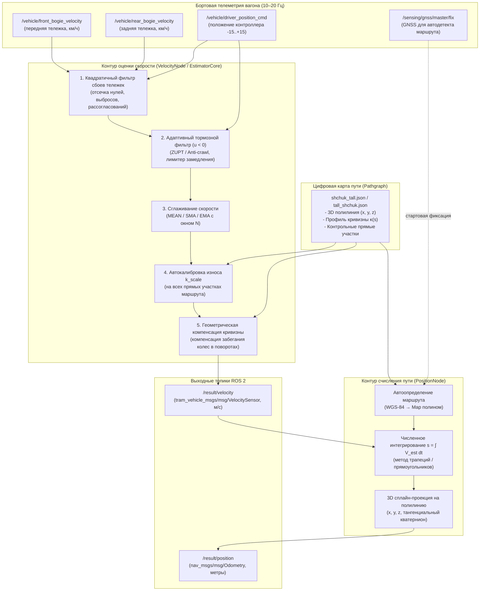

# ROS 2 Пакет: solution

Пакет резервной одометрии и счисления пути беспилотного трамвая в среде **ROS 2 Humble**.

Решение обеспечивает высокоточную оценку продольной скорости и 3D положения вагона трамвая в реальном времени при отказе, деградации или отсутствии спутниковой навигации (GNSS) по данным бортовой телеметрии колесных тележек и контроллера водителя.

---

## 1. Архитектура решения

Решение построено по модульному принципу и включает в себя два взаимозаменяемых сценария развертывания:
1. **Распределенный режим (Production-режим по ТЗ)**: запуск двух независимых нод через Launch-файл:
   - `velocity_node`: оценивает скорость вагона и фильтрует сбои датчиков тележек;
   - `position_node`: восстанавливает 3D координаты вагона вдоль рельсового пути с автоопределением маршрута по начальной позиции.
2. **Монолитный режим (`recovery_odometry_node`)**: единая высокопроизводительная нода, объединяющая оценку скорости и счисление пути в одном процессе.

### Схема обработки данных



---

## 2. Алгоритмическое ядро

### 2.1. Квадратичный фильтр сбоев датчиков скорости
Датчики колесных пар подвержены кратковременным помехам: случайным нулевым значениям, всплескам и асимметричным срывам сцепления:
- **Контроль пределов:** Значения $v > v_{\max}$ ($75$ км/ч) бракуются как аппаратные всплески (`SPIKE`).
- **Квадратичный контроль рассогласования тележек:** Проверяется условие $(v_1 - v_2)^2 > \Delta v_{\text{thresh}}^2$ ($3.6$ км/ч).
- **Детекция выпадения в ноль (`ZERO`):** Если одна тележка показывает $\approx 0$, а вторая движется ($v_2 \ge 2 \cdot v_{\text{zero}}$), нулевой датчик отбраковывается.
- **Детекция срыва сцепления (букс / юз):**
  - При тяге ($u_{\text{cmd}} > 0$): пробуксовывающее колесо ускоряется $\Rightarrow$ выбирается минимальная скорость $\min(v_1, v_2)$;
  - При торможении ($u_{\text{cmd}} < 0$): блокирующееся колесо замедляется $\Rightarrow$ выбирается максимальная скорость $\max(v_1, v_2)$;
  - При нейтрали ($u_{\text{cmd}} = 0$): выбирается тележка с минимальным квадратом отклонения от недавней средней скорости вагона.

### 2.2. Адаптивный тормозной фильтр (Driver Brake Filter)
Активируется при положении ручки контроллера в зоне торможения ($u_{\text{cmd}} < 0$ от $-1$ до $-15$ ступеней):
1. **Адаптивная отсечка ползучего хода (ZUPT / Anti-crawl):**
   При малых скоростях датчики часто шумят или продолжают генерировать ложные импульсы при полной остановке на колодках. Порог остановки адаптируется под ступень торможения:
   $$v_{\text{crawl}} = \frac{0.4 + 1.1 \cdot \frac{|u_{\text{cmd}}|}{15}}{3.6} \quad [\text{м/с}]$$
   Если $v_{\text{filt}} < v_{\text{crawl}}$, скорость вагона строго приравнивается к $0.0$ м/с, предотвращая накопление дрейфа на остановках и светофорах.
2. **Лимитер физического замедления (Anti-skid):**
   Физическое замедление вагона ограничено сцеплением колесо-рельс:
   $$a_{\text{lim}} = \min\left(a_{\max}, \; 1.0 + 2.0 \cdot \frac{|u_{\text{cmd}}|}{15}\right) \quad [\text{м/с}^2]$$
   Если измеренное колесами замедление $\frac{v - v_{\text{prev}}}{\Delta t} < -a_{\text{lim}}$, это сигнализирует о юзе (блокировке колес), и скорость вагона экстраполируется по допустимому физическому замедлению.
3. **Фиксация стоянки при выбеге ($u_{\text{cmd}} = 0$):**
   Если вагон уже стоял ($v_{\text{prev}} = 0$), паразитный шум датчиков ($< 0.4$ км/ч) подавляется до подтвержденного начала движения.

### 2.3. Сглаживание скорости (MEAN, SMA, EMA)
Поддерживается выбор алгоритма сглаживания скорости:
- **`mean` (по умолчанию)**: прямое среднее двух тележек без фазового запаздывания.
- **`sma`**: простое скользящее среднее по окну из $N$ измерений ($N$ настраивается).
- **`ema`**: экспоненциальное скользящее среднее с коэффициентом сглаживания $\alpha = \frac{2}{N + 1}$.

### 2.4. Автокалибровка коэффициента износа бандажей $k_{\text{scale}}$
Диаметр бандажей трамвайных колес уменьшается по мере эксплуатации (от номинальных $620$ мм до $540$ мм при предельном износе), что приводит к систематическому завышению скорости и пройденного расстояния колесными одометрами (ошибка до $3–5\%$).

Алгоритм калибровки:
1. Из цифровой карты пути извлекаются все прямолинейные участки ($|\kappa| < 0.0005 \text{ м}^{-1}$, что соответствует радиусу поворота $R > 2000$ м) длиной не менее $L_{\min} = 70$ м.
2. В процессе движения на каждом $j$-м прямом участке регистрируется приращение сырого пробега колес $\Delta R_{\text{wheels}}^{(j)}$.
3. Вычисляется локальный масштабный коэффициент:
   $$k_{\text{meas}}^{(j)} = \frac{L_{\text{map}}^{(j)}}{\Delta R_{\text{wheels}}^{(j)}}$$
4. Если измерение укладывается в физический диапазон износа $[0.97, 1.03]$, оно сохраняется. Итоговый коэффициент $k_{\text{scale}}$ на всем дальнейшем маршруте вычисляется как **робастная кумулятивная медиана**:
   $$k_{\text{scale}} = \text{median}\left(\{k_{\text{meas}}^{(1)}, k_{\text{meas}}^{(2)}, \dots, k_{\text{meas}}^{(m)}\}\right)$$
   Применение калибровки на всем пути маршрута снижает ошибку позиционирования более чем в 3 раза по сравнению с сырой одометрией.

### 2.5. Геометрическая компенсация кривизны поворотов
В кривых малого радиуса ($R \le 125$ м, $|\kappa| > 0.008\text{ м}^{-1}$) внешние и внутренние колеса проходят дуги разной длины, а конусность бандажей и проскальзывание гребней приводят к систематическому забеганию колесных датчиков относительно центральной оси вагона.
Применяется поправочный коэффициент кривизны:
$$\text{factor}_{\text{curve}} = \max\left(0.85, \; 1.0 - \beta \cdot (|\kappa| - \kappa_0)\right), \quad \text{где } \beta = 0.20, \; \kappa_0 = 0.008\text{ м}^{-1}$$
$$v_{\text{est}} = k_{\text{scale}} \cdot v_{\text{filt}} \cdot \text{factor}_{\text{curve}}$$

---

## 3. Спецификация интерфейсов топиков

### Входные топики (Subscribe)
| Топик | Тип сообщения | Частота | Назначение |
|---|---|---|---|
| `/vehicle/front_bogie_velocity` | `tram_vehicle_msgs/msg/VelocitySensor` | $\approx 10$ Гц | Линейная скорость колес передней тележки (км/ч) |
| `/vehicle/rear_bogie_velocity` | `tram_vehicle_msgs/msg/VelocitySensor` | $\approx 10$ Гц | Линейная скорость колес задней тележки (км/ч) |
| `/vehicle/driver_position_cmd` | `tram_vehicle_msgs/msg/DriverControllerCommand` | $\approx 20$ Гц | Положение ручки контроллера водителя $[-15 \dots +15]$ |
| `/sensing/gnss/master/fix` | `sensor_msgs/msg/NavSatFix` | $1$ Гц | Первичная фиксация GNSS для автоопределения направления маршрута |
| `/sensing/gnss/rover/fix` | `sensor_msgs/msg/NavSatFix` | $1$ Гц | Резервный канал фиксации GNSS |

### Выходные топики (Publish)
| Топик | Тип сообщения | Поле значения | Описание |
|---|---|---|---|
| `/result/velocity` | `tram_vehicle_msgs/msg/VelocitySensor` | `velocity` | Оцененная продольная скорость вагона (м/с) |
| `/result/position` | `nav_msgs/msg/Odometry` | `pose.pose.position` | Оцененная 3D позиция ($x, y, z$) и ориентация вагона на карте |

> **Временная синхронизация:** Метки времени `header.stamp` формируются строго из входных сообщений телеметрии, гарантируя синхронизацию с эталоном с точностью $< 0.05$ с при воспроизведении rosbag на любой скорости.

---

## 4. Конфигурация (`config/params.yaml`)

```yaml
velocity_node:
  ros__parameters:
    input_in_kmh: true                  # Входные датчики колес в км/ч (true) или м/с (false)
    integration_method: "trapezoidal"   # Метод интегрирования: "trapezoidal" или "rectangular"
    velocity_filter: "mean"             # Сглаживание скорости: "mean", "sma", "ema"
    enable_brake_filter: true           # Фильтр торможения: ZUPT и лимитер юза
    enable_curve_compensation: true     # Геометрическая компенсация кривизны поворотов
    child_frame_id: "base_link"

position_node:
  ros__parameters:
    frame_id: "map"                     # Имя глобальной системы координат карты
    child_frame_id: "base_link"         # Базовый фрейм вагона
```

---

## 5. Сборка и запуск

### 5.1. Сборка в ROS 2 Humble
```bash
# В корне рабочего пространства ROS 2
colcon build --packages-select tram_vehicle_msgs solution
source install/setup.bash
```

### 5.2. Запуск узлов (Рекомендуемый способ через Launch)
Запуск распределенной системы (`velocity_node` + `position_node`):
```bash
source install/setup.bash
ros2 launch solution recovery_odometry.launch.py
```

### 5.3. Запуск монолитной ноды
```bash
source install/setup.bash
ros2 run solution recovery_odometry_node --ros-args -p route:=щук-талл
```

---

## 6. Проверка и верификация решения

### 6.1. Воспроизведение rosbag
В отдельном окне терминала:
```bash
source install/setup.bash
ros2 bag play /path/to/recorded_bag
```

### 6.2. Проверка официальным чекером хакатона
```bash
ros2 run hackathon_solution_checker metrics --ros-args \
  -p reference_topic:=/localization/kinematic_state \
  -p velocity_topic:=/result/velocity \
  -p position_topic:=/result/position \
  -p sync_tolerance_sec:=0.05
```

---

## 7. Результаты валидации
