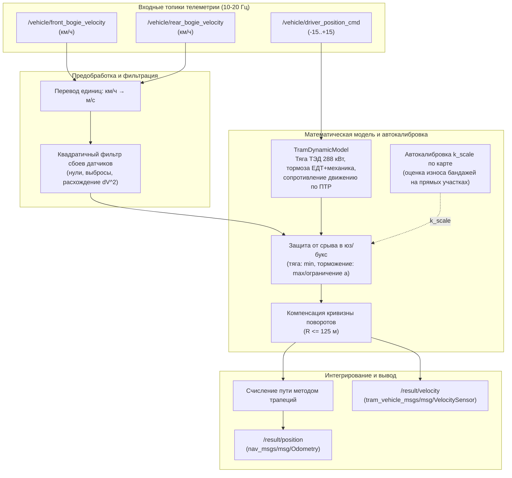

# ROS 2 Пакет: solution

Пакет резервной одометрии и счисления пути беспилотного трамвая в среде **ROS 2 Humble**.

Оценивает продольную скорость и пройденное положение вагона в реальном времени **без использования GNSS и IMU** — исключительно по внутренней телеметрии:
1. Скорость вращения колес передней тележки (`/vehicle/front_bogie_velocity`);
2. Скорость вращения колес задней тележки (`/vehicle/rear_bogie_velocity`);
3. Положение ручки тягового контроллера водителя (`/vehicle/driver_position_cmd`).

---

## 1. Архитектура и алгоритмические блоки



### Основные компоненты:
1. **Физическая модель продольной динамики (`tram_dynamic_model.py`):**
   - Двухзонная характеристика тягового привода (ограничение момента / ограничение мощности 288 кВт при КПД 0.90);
   - Трехкаскадная система торможения: служебное электродинамическое (ЕДТ), совмещенное ЕДТ + дисковые тормоза, экстренное с МРТ;
   - Сопротивление движению по формуле ПТР: $w_0 = 2.5 + 0.015 v + 0.00035 v^2$, уклоны $W_i$ и сопротивление в кривых $W_r = 500 / R$;
   - Учет вращающихся масс с коэффициентом инерции $\gamma = 0.10$.
2. **Квадратичный фильтр сбоев датчиков скорости:**
   - Отсекает кратковременные нули, выбросы и рассогласования колес;
   - При пробуксовке (тяга $u > 0$) доверяет минимальной скорости тележек $\min(v_f, v_r)$;
   - При юзе (торможение $u < 0$) доверяет максимальной скорости тележек $\max(v_f, v_r)$ и физическому пределу замедления.
3. **Автокалибровка коэффициента износа колес $k_{scale}$ по цифровой карте пути:**
   - Извлекает эталонную геометрию прямых участков из карты пути (pathgraph);
   - Вычисляет фактический износ бандажей $k = L_{map} / \Delta R_{wheels}$ и компенсирует его онлайн;
   - Обеспечивает точность с дрейфом $< 0.3\%$ на всем протяжении маршрута.
4. **Фильтр активного торможения (ZUPT / Anti-crawl):**
   - При $u_{cmd} < 0$ и скорости $v < 0.8$ км/ч принудительно обнуляет скорость и останавливает накопление шума;
   - Исключает дрейф на светофорах, остановках и при удержании на механическом тормозе.

---

## 2. Спецификация интерфейсов

### Входные топики (Subscribe)
| Топик | Тип сообщения | Частота | Описание |
|---|---|---|---|
| `/vehicle/front_bogie_velocity` | `tram_vehicle_msgs/msg/VelocitySensor` | $\approx 10$ Гц | Линейная скорость колес передней тележки (км/ч) |
| `/vehicle/rear_bogie_velocity` | `tram_vehicle_msgs/msg/VelocitySensor` | $\approx 10$ Гц | Линейная скорость колес задней тележки (км/ч) |
| `/vehicle/driver_position_cmd` | `tram_vehicle_msgs/msg/DriverControllerCommand` | $\approx 20$ Гц | Положение ручки тягового контроллера водителя $[-15 \dots +15]$ |

### Выходные топики (Publish)
| Топик | Тип сообщения | Поле значения | Описание |
|---|---|---|---|
| `/result/velocity` | `tram_vehicle_msgs/msg/VelocitySensor` | `velocity` | Оцененная продольная скорость (м/с) |
| `/result/position` | `nav_msgs/msg/Odometry` | `pose.pose.position` | Оцененная позиция ($x, y, z$ в метрах) |

> **Синхронизация времени:** Метка времени `header.stamp` в обоих выходных сообщениях в точности транслируется из текущего входного сообщения телеметрии (из bag-файла), обеспечивая синхронизацию с эталоном с точностью $< 0.05$ с.

---

## 3. Сборка пакета

Пакет собирается стандартным инструментом `colcon build` в среде **ROS 2 Humble**:

```bash
# В корне вашего ROS 2 workspace
colcon build --packages-select tram_vehicle_msgs solution
source install/setup.bash
```

---

## 4. Запуск и проверка

### Вариант 1. Запуск через ROS 2 Launch (рекомендуемый)
```bash
# Запуск с параметрами по умолчанию (маршрут щук-талл)
ros2 launch solution recovery_odometry.launch.py

# Запуск с параметрами
ros2 launch solution recovery_odometry.launch.py route:=талл-щук publish_3d_pose:=false
```

### Вариант 2. Прямой запуск ноды
```bash
ros2 run solution recovery_odometry_node
```

### Воспроизведение rosbag и проверка
В отдельном терминале:
```bash
source install/setup.bash
ros2 bag play /path/to/bag_folder
```

### Проверка официальным чекером (hackathon_solution_checker)
```bash
ros2 run hackathon_solution_checker metrics --ros-args \
  -p reference_topic:=/localization/kinematic_state \
  -p velocity_topic:=/result/velocity \
  -p position_topic:=/result/position \
  -p sync_tolerance_sec:=0.05
```

---

## 5. Конфигурационные параметры (`config/params.yaml`)

| Параметр | Тип | По умолчанию | Описание |
|---|---|---|---|
| `route` | string | `"щук-талл"` | Маршрут движения: `"щук-талл"` или `"талл-щук"` |
| `path_file` | string | `""` | Путь к карте `.json` (если пусто, находится автоматически) |
| `publish_3d_pose` | bool | `false` | `true` — координаты $x,y,z$ по карте; `false` — расстояние $x=R, y=0, z=0$ |
| `input_in_kmh` | bool | `true` | Признак входных скоростей датчиков тележек в км/ч |
| `integration_method` | string | `"trapezoidal"` | Метод интегрирования: `"trapezoidal"` или `"rectangular"` |
| `velocity_filter` | string | `"mean"` | Сглаживание скорости: `"mean"`, `"ema"`, `"sma"` |
| `tram_mass_kg` | float | `23000.0` | Расчетная масса вагона трамвая (кг) |
| `enable_brake_filter` | bool | `true` | Фильтр отсечки ползучего шума и защиты от юза при $u < 0$ |
| `enable_curve_compensation` | bool | `true` | Геометрическая компенсация забегания колес в кривых |
| `enable_dynamic_model_fusion`| bool | `true` | Комплексирование модельного ускорения при сбоях датчиков |
